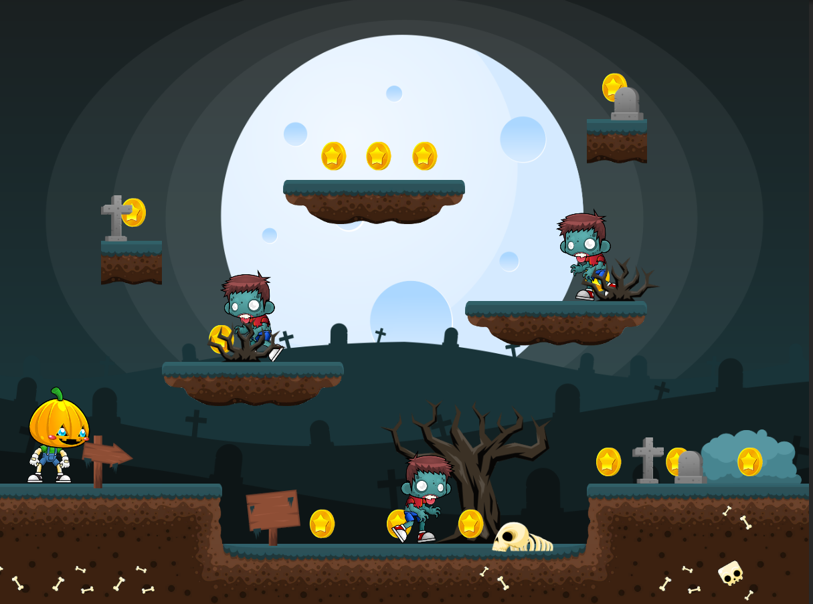

# 2DPlatformerSimpleScene

## Task
Create a simple 2D platformer in which to implement:
* Character control (running, jumping)
* Animation of running (jump is optional)
* Simple enemies who will patrol a small area
* Create a spawn of coins that can be collected.

## Personal additions
* animation for enemies
* animation of the deth of the player when he collides with the enemy
* animation of jumping
* background audio 
* audio of collecting coins

